# mall
此项目是一个基于 Golang，Gin，GORM，Mysql, Redis, ElasticSearch, Vue, WXML 等常用框架/工具搭建的商城系统，参考了 https://github.com/zchengo/mall 。
以原项目为基础，做了一定的调整，更符合 Restful API 风格，以及添加了后端部分功能，以学习、掌握后端技术栈为主要目的，如有任何问题欢迎 Issues 和私信交流讨论！！！

## 功能
|                             功能                             | 实现 | 待实现 |
| :----------------------------------------------------------: | :--: | :----: |
|               seller 登录/注册/验证码/Jwt鉴权                |  ✅   |        |
| seller 类目管理：新建/更新/删除类目，获取类目列表，获取类目选项 |  ✅   |        |
| seller 商品管理：新建/删除/更新商品，获取商品状态/信息/列表  |  ✅   |        |
|      seller 订单管理：删除/更新订单，获取订单详情/列表       |  ✅   |        |
|             seller 数据统计：卖出数量，卖出金额              |  ✅   |        |
|                       buyer 登录/注册                        |  ✅   |        |
|                   buyer 商品列表/搜索/详情                   |  ✅   |        |
|                 buyer 创建订单，查看订单列表                 |  ✅   |        |
|          buyer 添加/删除/清空购物车，获取购物车信息          |  ✅   |        |
|  buyer 收货地址管理：添加/删除/更新地址，查看地址信息/列表   |  ✅   |        |
|        buyer商品收藏管理：添加/删除收藏，获取收藏列表        |  ✅   |        |
|    buyer浏览记录管理：添加/删除浏览记录，获取浏览记录列表    |  ✅   |        |
|                 seller 前端/buyer 小程序注册                 |      |   ❎    |
|                 buyer 小程序删除收藏时有bug                  |      |   ❎    |
|                       诸多功能有待完善                       |      |   ❎    |
|                       后续功能有待丰富                       |      |   ❎    |


## 运行环境
|环境|版本|
|--|--|
|go|1.17.x|
|mysql|8.0.x|
|redis|6.0.x|
|elasticsearch|7.13.x|
|node.js|10.24.x|
|npm|6.14.x|

推荐 mysql, redis, elasticsearch 在 docker 中安装，很方便！

## 下载与运行
```shell
git clone https://github.com/sqdtss/mall.git
```
#### 执行 Sql 命令
###### 创建数据库 mall
```SQL
create databse mall;
use mall;
```
###### 创建数据表
分别执行 sql/address.sql, sql/buyer.sql, sql/seller.sql, sql/order.sql, sql/product.sql, sql/category.sql 中的 sql 语句以创建数据表。
(亦可改为 AutoMigrate, 因原项目如此设置，考虑到如此有如此的好处，加上懒【重点】，未改成 AutoMigrate 方式， 大佬可自行修改呀)
#### 运行 web seller 前端
```shell
cd front\ end/seller
npm install
npm run serve
```

#### 运行 微信小程序 buyer 前端
```shell
cd front\ end/buyer
npm install
```
在编译运行微信小程序之前，你需要进行以下设置：

1、在微信开发者工具右上角->【详情】->【本地设置】-> 选择【使用npm模块】和【不校验合法域名，web-view（业务域名）、TLS版本...】。
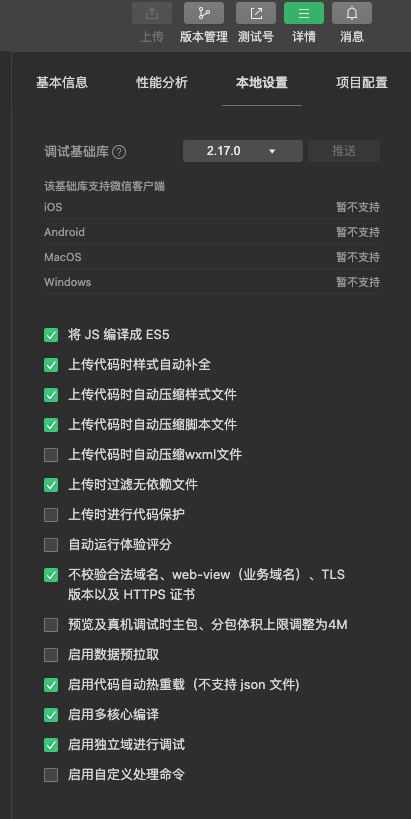

2、在微信开发者工具的工具栏->【工具】->【构建npm】。

#### 运行 server 后端
```shell
go generate
go build
./mall
```

## 运行截图
###### 卖家登录
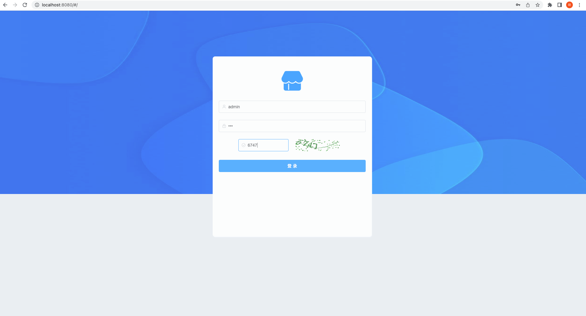
###### 首页
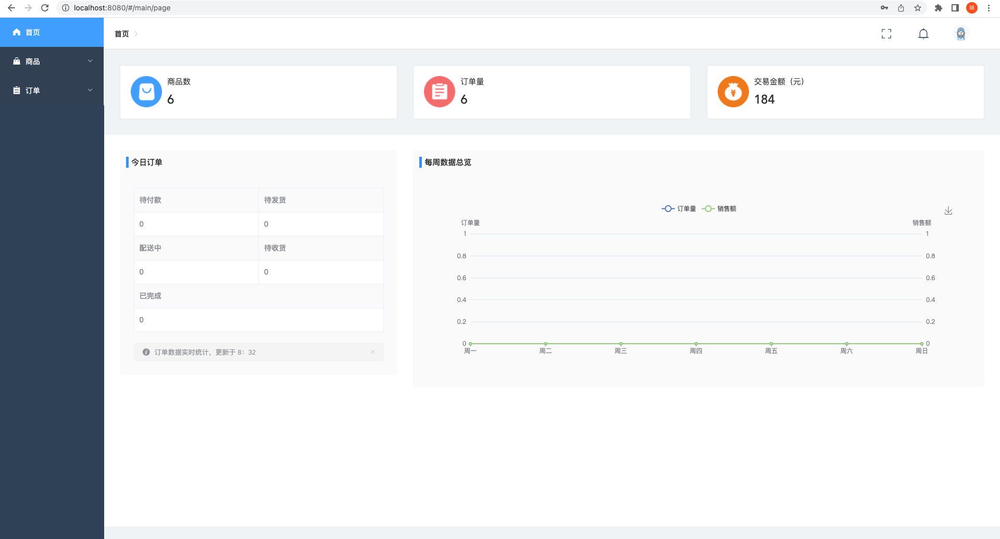
###### 商品
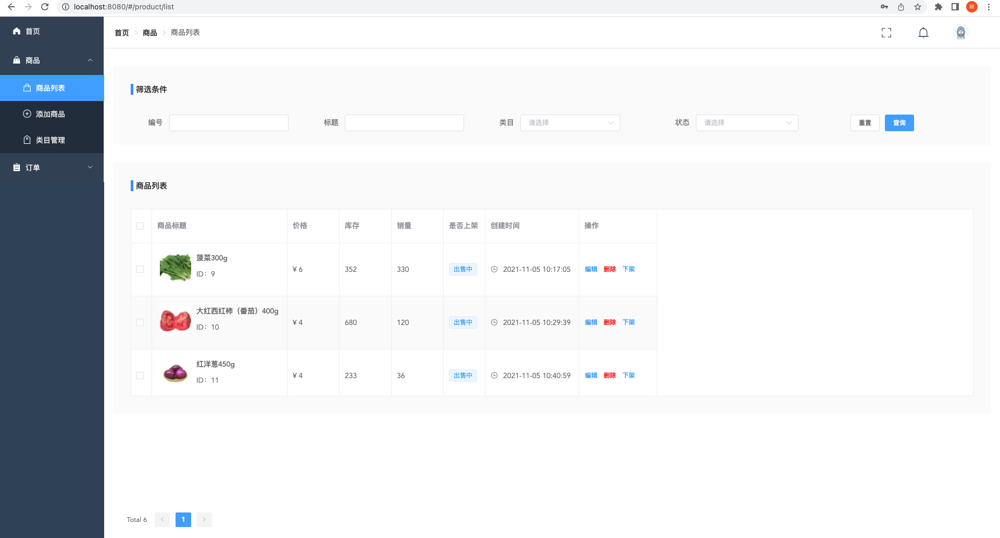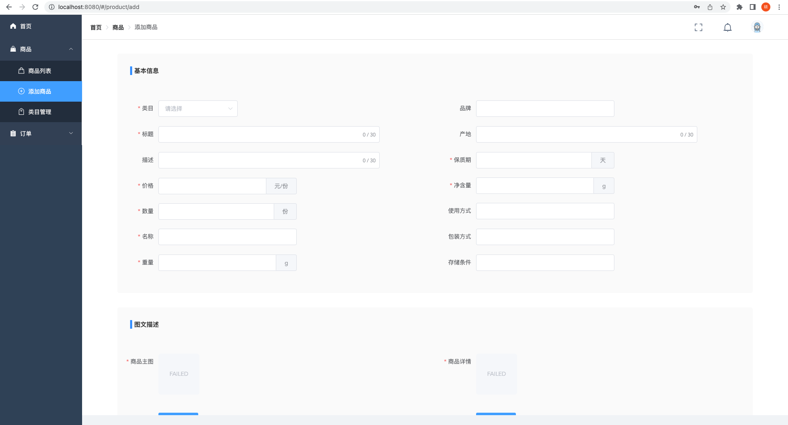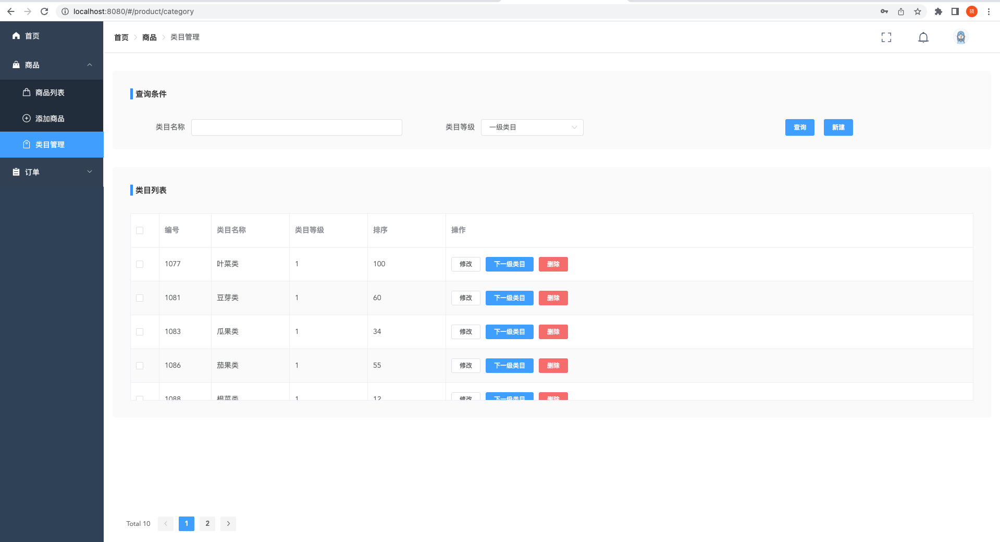
###### 订单
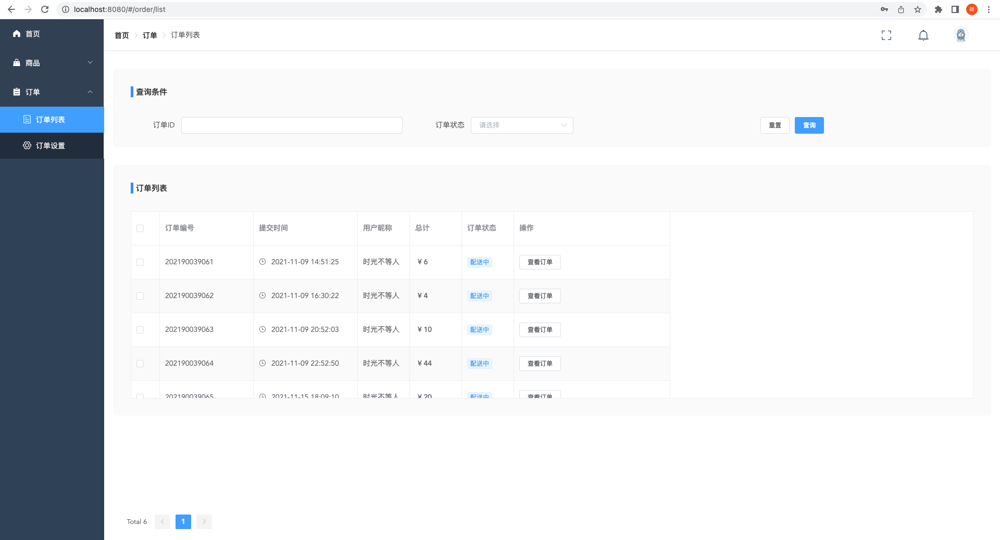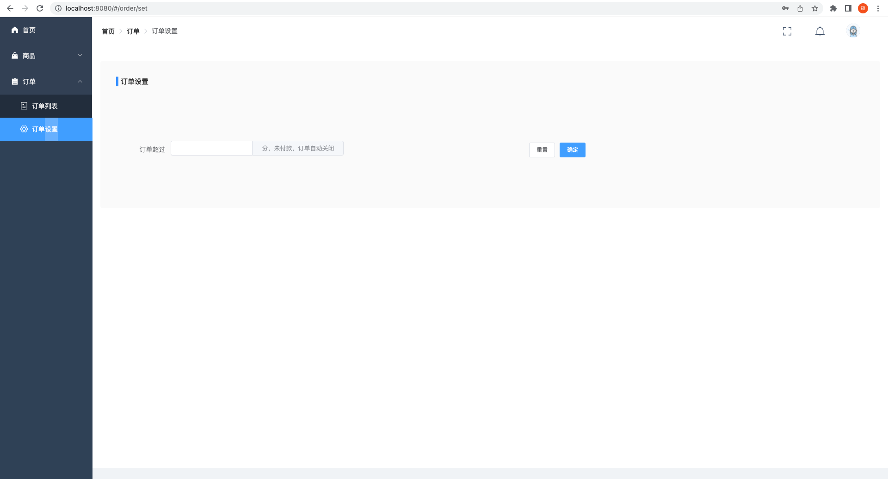
###### 买家登录
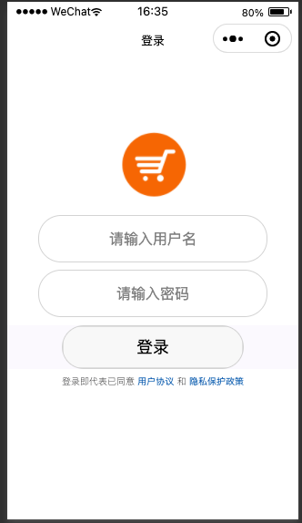
###### 首页
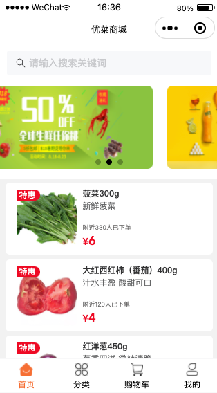
###### 分类
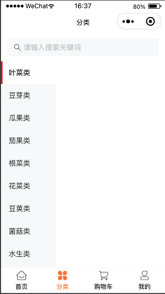
###### 购物车

###### 我的
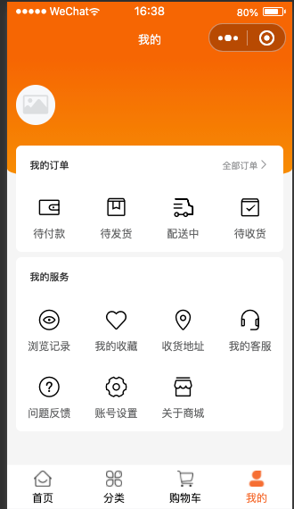